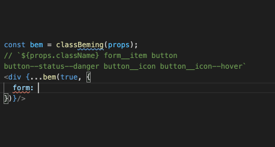
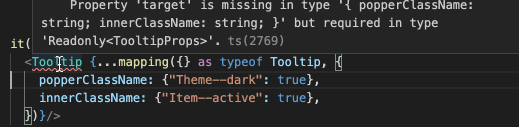

# [react-classnaming](github.com/askirmas/react-classnaming)

Tools to establish CSS classes as an explicit [abstraction layer](https://en.wikipedia.org/wiki/Abstraction_layer "a way of hiding the working details of a subsystem, allowing the separation of concerns to facilitate interoperability") and to handle it as an [interface](https://en.wikipedia.org/wiki/Interface_(computing) "a shared boundary across which two or more separate components of a computer system exchange information") between React and [CSSStyleDeclaration](https://developer.mozilla.org/en-US/docs/Web/API/CSSStyleDeclaration "exposes style information and various style-related methods and properties"). 

 

  [](https://codeclimate.com/github/askirmas/react-classnaming/issues) [](https://scrutinizer-ci.com/g/askirmas/react-classnaming/) [](https://deepscan.io/dashboard#view=project&tid=13158&pid=16163&bid=340904) [](https://www.codefactor.io/repository/github/askirmas/react-classnaming)

[](https://david-dm.org/askirmas/react-classnaming) [](https://www.npmjs.com/package/react-classnaming) 

     



## Objectives

1. Use CSS classes as an ontology of front-end project for clean communication between developers and non-tech staff
2. Make CSS classes be an explicit and predictable informational layer
3. Enforce declarative programming paradigm
4. Enforce contract programming (via TypeScript)

## Dev features

1. Enforce <u>single source of truth</u> of class appending – treat as TypeScript-driven dedupe
2. Require strict `boolean` for value of class condition
3. Use IDE type hints as developers' UX for faster issues resolving
4. BEM
5. CSS-modules agnostic

Use package like [`postcss-plugin-d-ts`](https://www.npmjs.com/package/postcss-plugin-d-ts) to prepare strict declaration of CSS 

## Installation and brief overview

```bash
npm install --save react-classnaming
```

```typescript
import {
  // Returns function for building `className: string` from conditioned CSS classes with "context" (if was provided) from `props` for using only declared CSS classes
  classNaming, 
  
  // Similar to classNaming, specifies mapping to component's (i.e. 3rd-party) `className`-related props
  classNamesMap,
  
  // Identical function for TS restriction on classes determed in CSS and not used in component
  classNamesCheck,
  
  // Works with BEM conditional object
  classBeming
} from "react-classnaming"

// Default export is the most frequently used function
import classNaming from "react-classnaming"

import type {
  // Type to declare component's self CSS classes
  ClassNamesProperty, 
    
  // Type to gather required CSS classes of sub-components
  ClassNames, 
    
  // `= string | undefined` – type to declare CSS class, global or local
  ClassHash, 
    
  // `= {className: string}` – useful shortcut
  ClassNamed 
} from "react-classnaming/types"
```

## Basic usage

Example of simple CSS classes conditioning – [\__tests__/readme.spec.tsx:9](./__tests__/readme.spec.tsx#L9-L31)

```tsx
import classNaming from "react-classnaming"

type Props = {
  isValid: boolean
  readOnly: boolean
}

// isValid = false, readOnly = false
function FormButtons({isValid, readOnly}: Props) {
  const cssClasses = classNaming()
  const buttonClass = cssClasses({"button": true}) // "button"

  return <>
    <button {
      ...buttonClass // className="button" 
    }>Close</button>
    <button type="reset" {
      ...buttonClass({"button--disabled": readOnly}) // className="button"
    }>Reset</button> 
                     { /* className="button_submit button button--disabled" */ }
    <button type="submit" className={`button_submit ${
      buttonClass({"button--disabled": readOnly || !isValid}) // "button button--disabled"
    }`}>Submit</button> 
  </>
}  
```

As shown, producing function `classNaming` returns a multipurpose object. It can be

- <u>recalled</u> to stack more CSS classes on conditions: `anotherClass = someClass({...})({...})`
- <u>destructed in</u> component's <u>props</u> as `className` singleton:  `<div {...someClass}/><button {...anotherClass}/>` 
- used as a <u>string</u>:  ` ``${someClass} ${anotherClass}`` `

## Demos

You can find demonstration with all main points in folder [./\__examples__/](./__examples__/), in addition *`*.test.*`* and *`*.spec.*`*. [](./images/vscode.png) 

## Getting more

### Condition is strictly `boolean`

Conditions with falsy values may lead to hardly caught bugs due to not obvious behavior for humans. In addition, as a possible `true` shortcut, the value can be not empty string as `class-hash` from CSS-module, and <u>`undefined`</u> for global CSS-class or modules simulation. Thus, to not keep in mind that `undefined` appears to be a truthy condition, it is prohibited on TypeScript level to mix in value type `boolean` with `ClassHash = string | undefined` and not allowed to use any other types like 0, null. [\__tests__/readme.spec.tsx:43](./__tests__/readme.spec.tsx#L43-L49)


### Single source of truth

There can be only ONE condition for each class in call pipe. Already conditioned classes are propagated to next call type notation so you can see currently stacked with according *modality*: `true`, `false` or `boolean`. [\__tests__/readme.spec.tsx:55](./__tests__/readme.spec.tsx#L55-L63)


### Declare own component's CSS classes

Only declared CSS classes will be allowed as keys with IDE hint on possibilities – [\__tests__/readme.spec.tsx:71](./__tests__/readme.spec.tsx#L71-L102)

```diff
+ import type { ClassHash, ClassNamesProperty } from "react-classnaming"

+ type MyClassNames = ClassNamesProperty<{
+   button: ClassHash
+   button_submit: ClassHash
+   "button--disabled": ClassHash
+ }>

- const cssClasses = classNaming()
+ const cssClasses = classNaming<MyClassNames>()
```


### BEM

It is possible to use BEM as condition query. With explicitly declared CSS classes (i.e. via [`postcss-plugin-d-ts`](https://www.npmjs.com/package/postcss-plugin-d-ts))  TS and IDE will check and hint on available blocks, elements, modifiers and values. [\__tests__/readme.spec.tsx:165](./__tests__/readme.spec.tsx#L165-L186)

```diff
import {
- classNaming 
+ classBeming
} from "react-classnaming"

- const cssClasses = classNaming<MyClassNames>()
+ const bemClasses = classBeming<MyClassNames>()
```


## Reference

### type `ClassNamed`
Shortcut  for `{className: string}`. 

### type `ClassHash`
For serving global and local CSS classes and not moduled CSS stylesheets. CSS-module will be imported as `{[cssClasses: string]: string}`, while for ordinary CSS import `require` returns just empty object `{}`. Their common notation is `{[cssClasses: string]: string | undefined} `, thus `type ClassHash = string | undefined`

### function [`classNaming`](https://github.com/askirmas/react-classnaming/projects/1)

Sets *context* for further type checks in supplying and toggling.

```typescript
classNaming()
classNaming<MyProps>()
classNaming<MyClassNames>()
classNaming({classnames: require("./some.css")})
classNaming({classnames: module_css, className})
classNaming(this.props)
```
Returns pipe-able (recallable) callback, that also can be destructed as `ClassNamed` or stringifyed

```tsx
const cssClasses = classNaming(...)
const btnClass = cssClasses({ button })

return                               
  <div {...btnClass } />
  <div data-block={`${btnClass}`} />
  <Component {...{
    ...btnClass(...)(...)(...)}
  }/>
```

On TS-level checks that Component's propagated `className` and certain CSS-class are conditioned once

```typescript
const conditionForClass1: boolean = false
const containerClass = classes(true, {class1: conditionForClass1})

const withClass1Twice = containerClass({
  class2: true,
  //@ts-expect-error – TS tracks that in chain there's only 1 place for class to be conditionally included 
  class1: otherCondiition
})

const withClassNameTwice = containerClass(
  //@ts-expect-error - Same for `className` - it is already added
  true
)
```

On `const` hovering will be tooltip with already conditioned classes under this chain

### function `classBeming`

Sets context to returned function for using BEM conditioned CSS classes queries. In general, argument's shape is

```typescript
type BemInGeneral = {
  [__Block__]: boolean | __Block_Mod__ | {
    [__Element__ | $ /*key for block mods*/]:  boolean | __BE_Mod__ | {
      [__Mod__]: false | (true | __BE_Mod_Value__ )
    }
  }
}
```

Table of output logic: 

> Tests @ [./src/bem.core.test.ts:13](https://github.com/askirmas/react-classnaming/blob/main/src/bem.core.test.ts#L13-L35)

| Returned `className`              | Query argument                                               |
| --------------------------------- | ------------------------------------------------------------ |
| `""`                              | `{block: false}`<br />`{block: {el: false}}`                 |
| <hr>                              | <hr>                                                         |
| `"block"`                         | `{block: true}`<br />`{block: {$: boolean \| {} \| {[mod]: false} }}` |
| `"block__el"`                     | `{block: {el: true \| {} \| {[mod]: false} }}`               |
| <hr>                              | <hr>                                                         |
| `"block block--mod"`              | `{block: "mod"}`<br/>`{block: {$: "mod" \| {mod: true} }}`   |
| `"block__el block__el--mod"`      | `{block: {el: "mod" \| {mod: true} }}`                       |
| <hr>                              | <hr>                                                         |
| `"block block--mod--val"`         | `{block: {$: {mod: "val"}}}`                                 |
| `"block__el block__el--mod--val"` | `{block: {el: {mod: "val"}}}`                                |

Mixins are deep merge of single possibilities in table


---

#### Setting options

Default options BEM naming:

- Element's separator is a double underscore `"__"`
- Modifier's and value's separator is a double hyphen `"--"`
- Key for block modifiers is `"$"`

It is required to change this options twice, both on JS (`setOpts(...)`) and TS `namespace ReactClassNaming { interface BemOptions {...} }`) levels

### function [`classNamesMap`](https://github.com/askirmas/react-classnaming/projects/5)

Function to map `classnames` to string props of some (i.e. 3rd-party) component.

```tsx
const { Root } = classnames
const mapping = classNamesMap(classnames)

<ThirdPartyComponent {...mapping({} as typeof ThirdPartyComponent, {
  ContainerClassName: { Root, "Theme--dark": true },
  Checked___true: classes({ "Item--active": true }),
  Checked___false: {}
})} />
```

For hint will be used such props of target component that can be assigned to `string`. After calling `mapping` function and setting other properties, usual TypeScript will check for presence of target's required properties and other ordinary for TS things.



### type [`ClassNamesProperty`](https://github.com/askirmas/react-classnaming/projects/3)

Declaration of self Component's `classnames`

```typescript
  type MyClasses = ClassNamesProperty<{
    class1: ClassHash
    class2: ClassHash
  }>
```
Can be restricted to use classes only from CSS module. *Note* Currently no IDE's tooltip for hints

```typescript
  type MyProps = ClassNamesProperty<
    typeof some_module_css,
    //@ts-expect-error
    {class1: ClassHash, class2: ClassHash, unknownClass: ClassHash}
  >
```

### type [`ClassNames`](https://github.com/askirmas/react-classnaming/projects/2)

Collects/gathers required `classnames` from used sub-Components

```typescript
type MyProps = ClassNames<true> // === ClassNamed === {className: string}
type MyProps = ClassNames<Props> // {classnames: Props["classnames"]}
type MyProps = ClassNames<typeof Component>
type MyProps = ClassNames<true, Props, typeof ClassComponent, typeof FunctionalComponent>
```

```tsx
type Props = ClassNames<true, Sub1Props, typeof Sub2>
  
function Component({className, classnames, "classnames": {Sub1Class}}: Props) {
  const classes = classNaming({classnames, className})
  
  return <div>
    <Sub1 {...classes(true, {Sub1Class})} classnames={classnames}/>
    <Sub2 {...{
        ...classes({Sub2Class: true}),
		classnames
    }}/>
  </div>
}
```

### type `ClassNamesFrom`

Obtain `classnames`-object from `props` of functional component, class component or props type

```typescript
ClassNamesFrom<ComponentProps>;
ClassNamesFrom<typeof Component>;
```

### function [`classNamesCheck`](https://github.com/askirmas/react-classnaming/projects/4)

Identical function or returning constant `EMPTY_OBJECT` for keys check of not used classes in components tree 

```tsx
import css from "./page.scss"
import App from "./App.tsx"

ReactDOM.render(<App classnames={classNamesCheck(...)} />
```
- Dummies shape
```tsx
<Component classnames={classNamesCheck()} />;
```
- Checks CSS with defined (not indexed) classes keys. To produce such declaration you can use package [`postcss-plugin-d-ts`](https://www.npmjs.com/package/postcss-plugin-d-ts).
```tsx
import type { ClassNamesFrom } from "react-classnaming/types";
import css_module from "./some.css"; // With class `.never-used {...}`

<Component classnames={classNamesCheck(
  css_module, 
  //@ts-expect-error Property 'never-used' is missing
  {} as ClassNamesFrom<typeof Component>
)} />;
```

## Misc 

### Restructuring

#### Using CSS-modules or simulation

It is possible to use CSS modules or simulation without "context" by supplying class-hash value with variable [\__tests__/readme.spec.tsx:114](./__tests__/readme.spec.tsx#L114-L153)

```diff
// CSS-module, assuming "button" will be replaced with "BTN"
+ import css_module from "./button.module.css"
+ const { button } = css_module
// Module simulation
+ type CssModuleSimulation = { button_submit: ClassHash }
+ const { button_submit } = {} as CssModuleSimulation
  
  type MyClassNames = ClassNamesProperty<
+   typeof css_module &
+   CssModuleSimulation & 
    {
-     button: ClassHash
-     button_submit: ClassHash
      "button--disabled": ClassHash
    }
 >

- const buttonClass = cssClasses({ button: true })
+ const buttonClass = cssClasses({ button })

  <button type="submit" {...buttonClass({
-    "button_submit": true, 
+    button_submit,
    "button--disabled": readOnly || !isValid
  })}>Submit</button>  
```

### Versus [`classnames`](https://github.com/JedWatson/classnames#readme) package

See [src/versus-classnames.test.ts](./src/versus-classnames.test.ts)

//TODO Copy here the most significant TS errors

#### No css-modules, just simulation

```tsx
import classnames from "classnames"
<div className={classnames("class1", "class2")} />
<div id={classnames("class1", "class2")} />

// VERSUS

import css from "./some.css"
import classNaming, {classNamesCheck} from "react-classnaming"
import type {ClassNames} from "react-classnaming"

const { class1,
  //@ts-expect-error
  whatever
} = classNamesCheck<...>(css)

const props: ClassNames<"class2"> = {"classnames": css}

const {class2} = props.classnames

<div {...classNaming({class1, class2})} />
<div id={`${classNaming({class1, class2})}`} />
```

#### CSS module

```tsx
import module_css from "./some.module.css" // {"class1": "hash1", "class2": "hash2"}

import classnames_bind from "classnames/bind"
const cx = classnames_bind.bind(module_css)
// No error on redundant CSS-class
<div className={cx("class1", {"class3": true})} />

// VERSUS

import classNaming from "react-classnaming"
const clases = classNaming({classnames: module_css})
//@ts-expect-error Argument of type '"class3"' is not assignable to parameter
<div {...clases({class1: true, class3: true})} />
```
