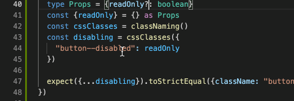
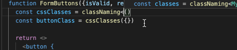

# [react-classnaming](github.com/askirmas/react-classnaming)

Tools to establish CSS classes as an explicit [abstraction layer](https://en.wikipedia.org/wiki/Abstraction_layer "a way of hiding the working details of a subsystem, allowing the separation of concerns to facilitate interoperability") and to handle it as an [interface](https://en.wikipedia.org/wiki/Interface_(computing) "a shared boundary across which two or more separate components of a computer system exchange information") between React and [CSSStyleDeclaration](https://developer.mozilla.org/en-US/docs/Web/API/CSSStyleDeclaration "exposes style information and various style-related methods and properties"). 

 

  [](https://codeclimate.com/github/askirmas/react-classnaming/issues) [](https://scrutinizer-ci.com/g/askirmas/react-classnaming/) [](https://deepscan.io/dashboard#view=project&tid=13158&pid=16163&bid=340904) [](https://www.codefactor.io/repository/github/askirmas/react-classnaming)

[](https://david-dm.org/askirmas/react-classnaming) [](https://www.npmjs.com/package/react-classnaming) 

[TOC]

     

## Objectives

1. Make CSS classes to be explicit and predictable project layer
2. Enforce declaration style programming
3. Enforce contract based development via TypeScript
4. Enforce single source of truth
5. Enforce class-conditions to be strictly `boolean`, not ~~`falsy|truthy`~~
6. Use IDE type hints as developers UX for faster issues resolving
7. CSS-modules agnostic

## Installation and import

```bash
npm install --save react-classnaming
```

```typescript
import {
  classNaming, // Returns function for building `className: string` from conditioned CSS classes with "context" (if was provided) from `props` for using only declared CSS classes
  classNamesMap, // Similar to classNaming, specifies mapping to component's (i.e. 3rd-party) `className`-related props
  classNamesCheck // Identical function for TS restriction on classes determed in CSS and not used in component
} from "react-classnaming"

// Default export is the most frequently used function
import classNaming from "react-classnaming"

// Import module with specific function only
import { classNaming } from "react-classnaming/naming"
import { classNamesCheck } from "react-classnaming/check"
import { classNamesMap } from "react-classnaming/map"

import type {
  ClassNamesProperty, // Type to declare component's self CSS classes
  ClassNames, // Type to gather required CSS classes of sub-components
  ClassHash, // `= string | undefined` – type to declare CSS class, global or local
  ClassNamed  // `= {className: string}` – useful shortcut
} from "react-classnaming/types"
```

## Basic usage

Example of simple CSS classes conditioning – [\__tests__/readme.spec.tsx:7](./__tests__/readme.spec.tsx#L7-L28)

```tsx
import classNaming from "react-classnaming"

type Props = {
  isValid: boolean
  readOnly: boolean
}

// isValid = false, readOnly = false
function FormButtons({isValid, readOnly}: Props) {
  const cssClasses = classNaming()
  const buttonClass = cssClasses({"button": true}) // "button"

  return <>
    <button {
      ...buttonClass // className="button" 
    }>Close</button>
    <button type="reset" {
      ...buttonClass({"button--disabled": readOnly}) // className="button"
    }>Reset</button> 
    <button type="submit" className={`button_submit ${
      buttonClass({"button--disabled": readOnly || !isValid}) // "button button--disabled"
    }`}>Submit</button> 
  </>
}  
```

As shown, producing function `classNaming` returns a multipurpose object. It can be

- recalled to stack more CSS classes on conditions: `anotherClass = someClass({...})({...})`
- destructed in component's props as `className` singleton:  `<div {...someClass}/> <button {...anotherClass}/>` 
- used as a string:  ` ``${someClass} ${anotherClass}`` `

## Demos

You can find demonstration with all main points in folder [./\__examples__/](./__examples__/), in addition to present *`*.test.*`* and *`*.spec.*`*.

## Getting more

### Condition is strictly `boolean`

Conditions with falsy values may lead to hardly caught bugs due to not obvious behavior for humans. In addition, as a possible `true` shortcut, the value can be not empty string as `class-hash` from CSS-module, and <u>`undefined`</u> for global CSS-class or modules simulation. Thus, to not keep in mind that `undefined` appears to be a truthy condition, it is prohibited on TypeScript level to mix in value type `boolean` with `ClassHash = string | undefined` and not allowed to use any other types like 0, null. [\__tests__/readme.spec.tsx:40](./__tests__/readme.spec.tsx#L40-L46)



### Single source of truth

There can be only ONE condition for each class in call pipe. Already conditioned classes are propagated to next call type notation so you can see currently stacked with according *modality*: `true`, `false` or `boolean`. [\__tests__/readme.spec.tsx:52](./__tests__/readme.spec.tsx#L52-L60)


### Declare own component's CSS classes

```diff
+ import type { ClassHash, ClassNamesProperty } from "react-classnaming"

+ type MyClassNames = ClassNamesProperty<{
+   button: ClassHash
+   button_submit: ClassHash
+   "button--disabled": ClassHash
+ }>

- const cssClasses = classNaming()
+ const cssClasses = classNaming<MyClassNames>()
```

Only declared CSS classes will be allowed as keys with IDE hint on possibilities – [\__tests__/readme.spec.tsx:68](./__tests__/readme.spec.tsx#L68-L94)



## Old

### Extending to more complex

- If some CSS classes are not conditional but static – you can declare them as `const`-s with `undefined` value 

```diff
import classNaming from "react-classnaming"
+ import type { CssModule } from "react-classnaming"
+ const { btn } = {} as CssModule
...
- const btnClass = cssClasses({ "btn": true, "icon": false })
+ const btnClass = cssClasses({ btn })
```

- If you want to re-use some CSS classes across tsx-components, but don't ready to switch completely to CSS modules – you just need to write `some.css.d.ts` declaration file (or use [postcss-plugin-d-ts](https://www.npmjs.com/package/postcss-plugin-d-ts)). For example:

```typescript
// some.css.d.ts
declare const css: {
  btn: undefined|string
}
export default css
```

Then, import it as `default` and/or destructed items

```diff
- import type { CssModule } from "react-classnaming"
- const { btn } = {} as CssModule
+ import { btn } from "./some.css"
// or
+ import styles from "./some.css"
+ const { btn } = styles
```

- To sum up all previous and with submit's icon as addition

```tsx
import React from "react"
import classNaming from "react-classnaming"
import type { CssModule } from "react-classnaming"

// Assuming .icon and .btn--disabled are local css-classes and will be hashed to "hash-i" and "hash-b-d" accordingly
import styles, { btn } from "./some.css"

const { ripple } = {} as CssModule

// Assuming `props = {className: "form-button", isValid: false}`
const FormButtons = ({className, isValid}: {className: string, isValid: boolean}) => {
  const injectedClasses = classNaming()
  
  const cssClasses = classNaming({className, classnames: styles})
  const btnClass = cssClasses({ btn })
  
						  // {className: "ripple"}
  return <div {...injectedClasses({ ripple })} >
    <button className={
      `${btnClass}` // "btn"
    }>Close</button>
    <button type="reset" {
      ...btnClass(true) // {className: "form-button btn"}
    }>Reset</button> 
    <button type="submit" {
      ...btnClass(true, { "btn--disabled": !isValid, "btn--enabled": isValid }) // {className: "form-button btn hash-b-d"}
    }>
      <i {...cssClasses({icon: true}) /**{className: "hash-i"}*/}>✓</i>
      Submit
    </button> 
  </>
}
```

## Reference

### type `ClassNamed`
Shortcut  for `{className: string}`. 

### type `ClassHash`
For serving ordinary and modules CSS. Css-module will be imported as `{[cssClasses: string]: string}`, while pure `require` returns just empty object `{}`. Their common notation is `{[cssClasses: string]: string | undefined} `, thus `type ClassHash = string | undefined`

### function [`classNaming`](https://github.com/askirmas/react-classnaming/projects/1)

Sets *context* for further type checks in supplying and toggling.

```typescript
classNaming()
classNaming<MyProps>()
classNaming<MyClassNames>()
classNaming({classnames: require("./some.css")})
classNaming({classnames: module_css, className})
classNaming(this.props)
```
Returns pipe-able callback, that also can be destructed as `ClassNamed` or stringified

```tsx
const cssClasses = classNaming(...)
return                               
  <div {...cssClasses(...)} />
  <div data-block={`${cssClasses(...)}`} />
  <Component {...{
    ...cssClasses(...)(...)(...)}
  }/>
```

On TS-level checks that Component's propagated `className` and certain CSS-class are conditioned once

```typescript
const conditionForClass1: boolean = false
const containerClass = classes(true, {class1: conditionForClass1})

const withClass1Twice = containerClass({
  class2: true,
  //@ts-expect-error – TS tracks that in chain there's only 1 place for class to be conditionally included 
  class1: otherCondiition
})

const withClassNameTwice = containerClass(
  //@ts-expect-error - Same for `className` - it is already added
  true
)
```

On `const` hovering will be tooltip with already conditioned classes under this chain

### type [`ClassNamesProperty`](https://github.com/askirmas/react-classnaming/projects/3)

Declaration of self Component's `classnames`

```typescript
  type MyClasses = ClassNamesProperty<{
    class1: ClassHash
    class2: ClassHash
  }>
```
Can be restricted to use classes only from CSS module. *Note* Currently no IDE's tooltip for hints

```typescript
  type MyProps = ClassNamesProperty<
    typeof some_module_css,
    //@ts-expect-error
    {class1: ClassHash, class2: ClassHash, unknownClass: ClassHash}
  >
```

### type [`ClassNames`](https://github.com/askirmas/react-classnaming/projects/2)

Collects/gathers required `classnames` from used sub-Components

```typescript
type MyProps = ClassNames<true> // === ClassNamed === {className: string}
type MyProps = ClassNames<Props> // {classnames: Props["classnames"]}
type MyProps = ClassNames<typeof Component>
type MyProps = ClassNames<true, Props, typeof ClassComponent, typeof FunctionalComponent>
```

```tsx
type Props = ClassNames<
  true,
  Sub1Props,
  typeof Sub2
>
  
function Component({className, classnames, "classnames": {Sub1Class}}: Props) {
  const classes = classNaming({classnames, className})
  
  return <div>
    <Sub1 {...classes(true, {Sub1Class})} classnames={classnames}/>
    <Sub2 {...{
        classes({Sub2Class: true}),
				classnames
    }}/>
  </div>
}
```

### function [`classNamesCheck`](https://github.com/askirmas/react-classnaming/projects/4) 

*//TODO #16*

TS will check on root level that no CSS class is lost, and, in addition, you can check that you haven't redundant

```tsx
import css from "./page.scss"
import App from "./App.tsx"

ReactDOM.render(<App classnames={classNamesCheck(css)} />
```

### function [`classNamesMap`](https://github.com/askirmas/react-classnaming/projects/5)

Function to map one `classnames` to another

```tsx
  <ThirdPartyComponent {...mapping<ComponentProps>({
    Container: { Root, "Theme--dark": true },
    Checked___true: { "Item--active": true },
    Checked___false: {}
  })}/>
```

## Getting Started //TODO

- Component usage: `classNames`

- Component declaration: `ClassNamesProperty`, `ClassHash`

- Collecting: `ClassNames`

- Root supply: `classNamesCheck`

- With `*.css.d.ts`


### Root apply

```tsx
import {classNamesCheck} from "react-classnaming"

ReactDOM.render( <Root classnames={classNamesCheck()}/> )

import css from "./module.css"

ReactDOM.render( <Root classnames={classNamesCheck(css))} /> )
ReactDOM.render( <Root classnames={classNamesCheck<typeof Root, typeof css>(css))} /> )
```

## Explaining and recipes

### Declarative style programming

```tsx
import type {ClassNamesProperty, ClassHash} from "react-classnaming"

type ComponentClassNames = ClassNamesProperty<{
  App: ClassHash
  App__Item: ClassHash
}>
```

```tsx
import type {ClassNames} from "react-classnaming"

type AppProps = {
  isMyAppGreat: boolean
} & ClassNames<
  true, // props.className: string
  AppClassNames,
  ComponentProps,
  typeof ClassComponent,
  typeof FunctionalComponent
>
```

### Returning *stringable* object

```typescript
<div {...classNaming({App})} data-block={`${classNaming({App})}`} />
```

### Reusability by pipe calls

```tsx
const c = classNaming(className) // className: "Cell"
, Col1 = c({ Column_1 })
, Col2 = c({ Column_2 })

<div {...Col1({ Row_1 })} />; // className="Cell Column_1 Row_1"
<div {...Col1({ Row_2 })} />; // className="Cell Column_1 Row_2"
<div {...Col2({ Row_1 })} />; // className="Cell Column_2 Row_1"
<div {...Col2({ Row_2 })} />; // className="Cell Column_2 Row_2"
```

### Class names control by type check of keys

*//TODO add example*

### Playing together with IDE renames

*//TODO add example*

### With and without CSS modules

```tsx
import css from "./css" // css === {}
import module_css from "./module_css" // module_css === {"class1": "hash1", ...}

<App classnames={css} />;
<App classnames={module} />;
```

## Misc 

### Versus [`classnames`](https://github.com/JedWatson/classnames#readme) package

See [src/versus-classnames.test.ts](./src/versus-classnames.test.ts)

//TODO Copy here the most significant TS errors

#### No css-modules, just simulation

```tsx
import classnames from "classnames"
<div className={classnames("class1", "class2")} />
<div id={classnames("class1", "class2")} />

// VERSUS

import css from "./some.css"
import classNaming, {classNamesCheck} from "react-classnaming"
import type {ClassNames} from "react-classnaming"

const { class1,
  //@ts-expect-error
  whatever
} = classNamesCheck<...>(css)

const props: ClassNames<"class2"> = {"classnames": css}

const {class2} = props.classnames

<div {...classNaming({class1, class2})} />
<div id={`${classNaming({class1, class2})}`} />
```

#### CSS module

```tsx
import module_css from "./some.module.css" // {"class1": "hash1", "class2": "hash2"}

import classnames_bind from "classnames/bind"
const cx = classnames_bind.bind(module_css)
// No error on redundant CSS-class
<div className={cx("class1", {"class3": true})} />

// VERSUS

import classNaming from "react-classnaming"
const clases = classNaming({classnames: module_css})
//@ts-expect-error Argument of type '"class3"' is not assignable to parameter
<div {...clases({class1: true, class3: true})} />
```
