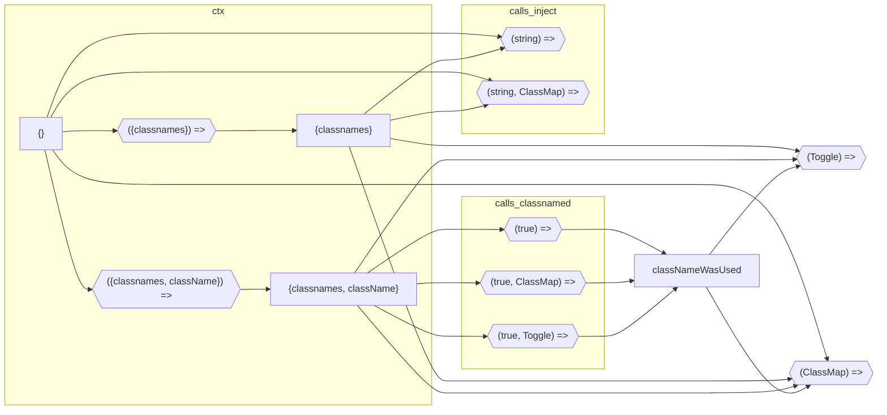

# Core

[TOC]

## Interfaces chain

|                        | `null` | `{classnames}` | `{classnames, className}` | ~~`{className}`~~ |
| ---------------------- | ------ | -------------- | ------------------------- | ----------------- |
| `(string)`             | +      | -?             | -?                        | ~~-?~~            |
| `(ClassMap)`           | +      | +?             | +?                        | ~~+~~             |
| `(true)`               | -      | -              | +                         | ~~+~~             |
| `(Toggle)`             | -      | +              | +                         | ~~-~~             |
|                        |        |                |                           |                   |
| `(string, ClassMap)`   | +      | ?              | ?                         | ~~?~~             |
| `(true, ClassMap)`     | -      | -              | +?                        | ~~+~~             |
| `(true, Toggle)`       | -      | -              | +                         | ~~-~~             |
|                        |        |                |                           |                   |
| ~~`(string, Toggle)`~~ |        |                |                           |                   |
| ~~`(true, string)`~~   |        |                |                           |                   |

## Ctx * Action

|            | hash?                  | value       | result                            |
| ---------- | ---------------------- | ----------- | --------------------------------- |
| Global CSS | `undefined`            | `undefined` | `key`                             |
| CSS module | `undefined`            | `"string"`  | `value`                           |
| Toggle off | `"hash"` | `undefined` | `false`     | -omit-                            |
| Toggle on  | `"hash"`               | `true`      | `hash`                            |
|            |                        |             |                                   |
|            | `"hash"`               | `undefined` | *`hash`? `key`? -omit-?*          |
|            | `"hash"`               | `"string"`  | *`hash`? `key`? `value`? -omit-?* |
|            | `undefined`            | `true`      | *`key`? -omit-?*                  |
|            | `"hash"` | `undefined` | `0`         | *`hash`? `key`? -omit-?*          |
|            | `"hash"` | `undefined` | `""`        | *`hash`? `key`? -omit-?*          |
|            | `"hash"` | `undefined` | `null`      | *`hash`? `key`? -omit-?*          |
|            | `"hash"` | `undefined` | `Truthy`    | *`hash`? `key`? -omit-?*          |

